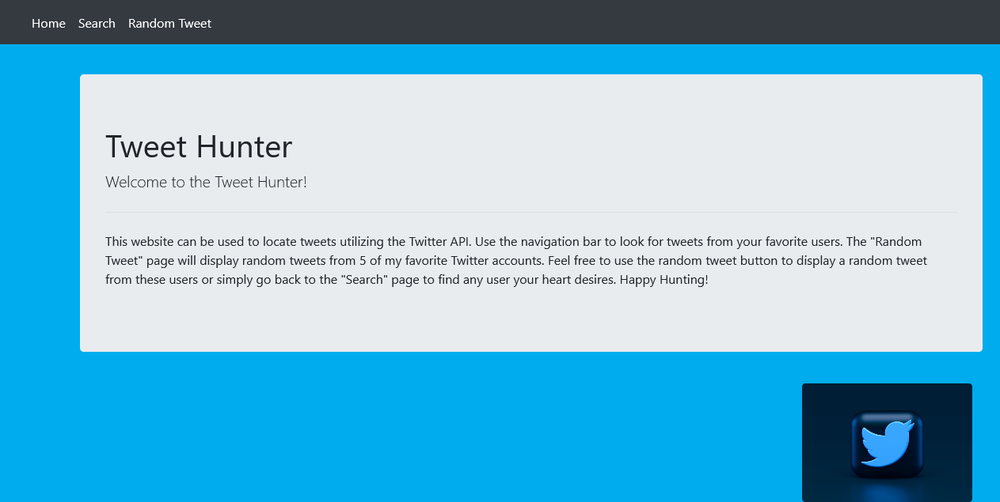
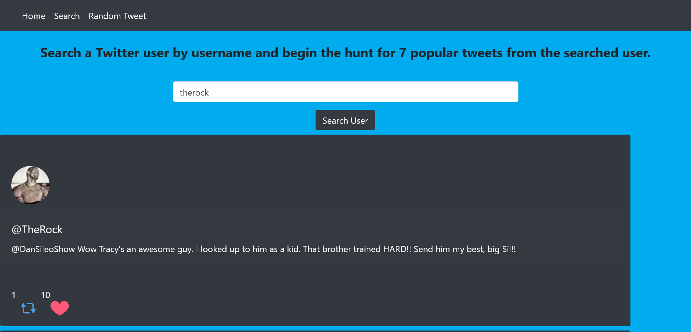
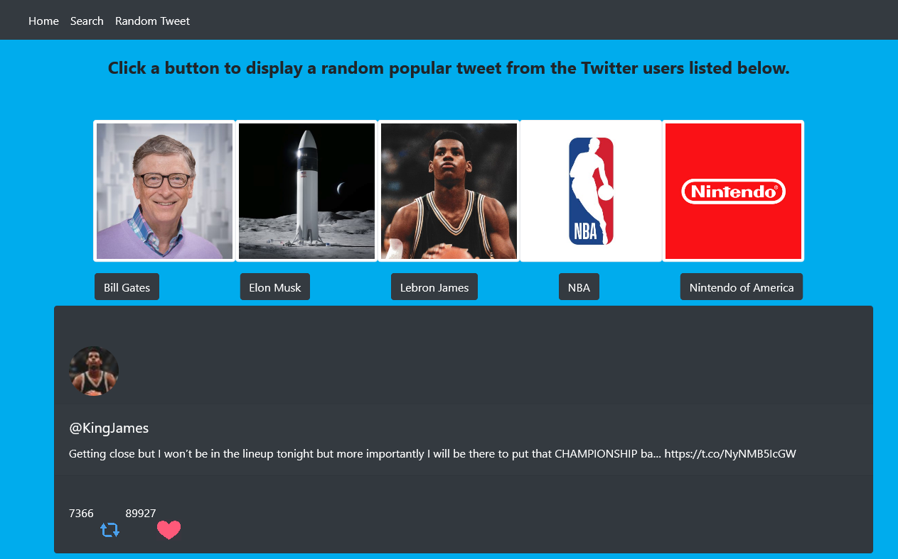

# Tweet Hunter
A Twitter API App

A fullstack application utilizing data from the Twitter API. Created with React, Bootstrap, Node, and Express. 

### Try out the app by clicking [here](https://wandering-frost-1321.herokuapp.com/)

# Pages 

## Home Page 

## Search Page 

Use this page to search a twitter user by screen name and display 7 of their popular tweets!

## Random Tweet Page 

On this page you can click a button to display a random tweet from one of the five users pictured above. 

## Summary 

My first ever full stack website I have ever created. Although it was challenging learning how to implement a back end server I felt like my programming skills grew the most with creating this app. Due to the high number of moving parts of this app, I felt like my debugging skills were coming toegether when I created this app. I felt really comfortable navigating inside the developer console to debug the issues I ran into whenever I was constructing each individual piece. Reflecting back, I would say the creation of this application gave me the confidence I needed to get out there and start applying for software developer roles, especially now that I am seeing the bigger picture of what skills a developer needs to code professionally. 

## Author 

Dante Leeseberg - Full Stack Software Developer [LinkedIn](https://www.linkedin.com/in/dante-leeseberg-bba05883/) | [Website](https://www.danteleeseberg.com/)